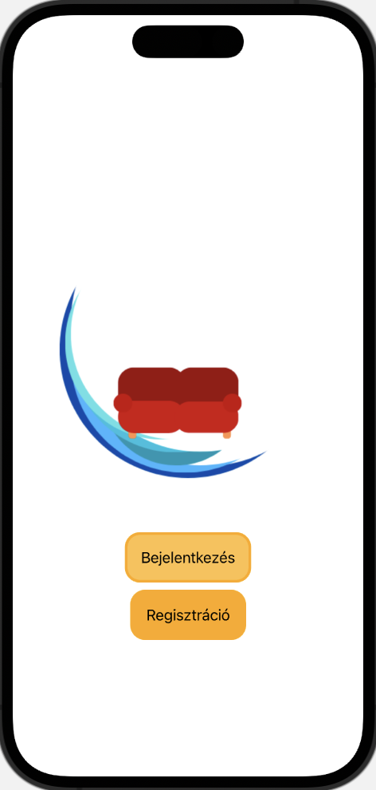
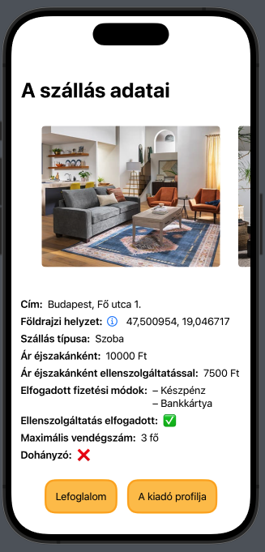
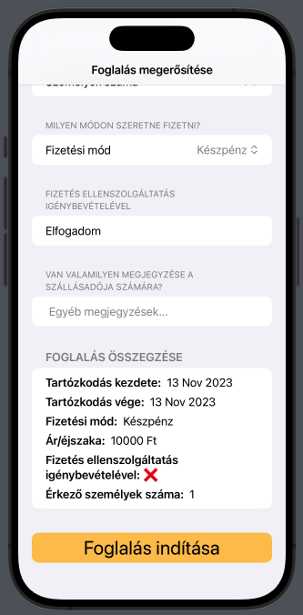
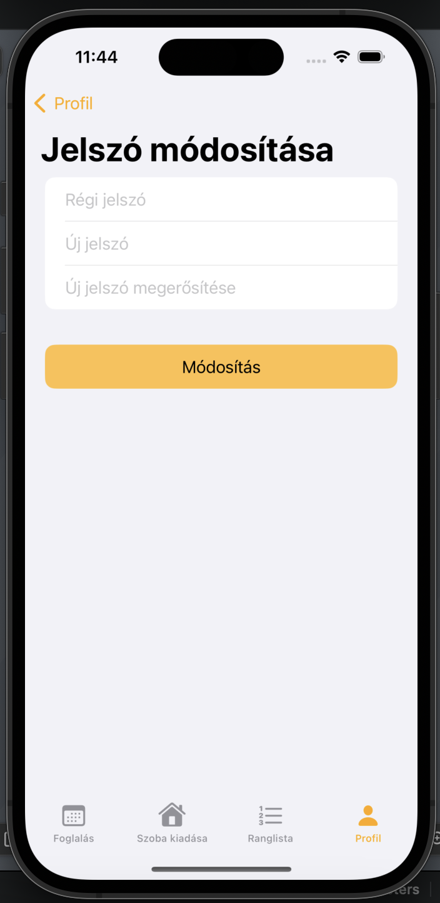

# Couchsurfing app összefoglaló dokumentum

## Belépési flow

### Indulási képernyő

- Képernyőterv:\


- Képernyő:\


- Backend érintettség: -

### Bejelentkezési képernyő

- Képernyőterv:\


- Képernyő:\


- Backend érintettség:
    - <u>Végpont:</u> **POST /api/auth/login**
    - <u>Kérés:</u>\
    Body-ban:
    ```javascript
    {
        email: string,
        password: string
    }
    ```
    - <u>Válasz:</u>
        - Sikeres: **200-as státuszkód**, body-ban:
        ```javascript
        {
            accessToken: string,
            timeout: long,
            tokenType: string,
            roles: string[]
        }
        ```
        - Hiba ág: **404-es hibakód** kerül visszaküldésre a kliensnek

### Regisztrációs képernyő

- Képernyőterv:\


- Képernyő:\


- Backend érintettség:
    - <u>Végpont:</u> **POST /api/auth/register**
    - <u>Kérés:</u>\
    Body-ban:
    ```javascript
    {
        fullName: string,
        username: string,
        birthDate: date,
        email: string,
        phone: string,
        password: string
    }
    ```
    - <u>Válasz:</u>
        - Sikeres: **200-as státuszkód**, body-ban:
        ```javascript
        {
            userId: int,
            fullName: string,
            username: string,
            birthDate: date,
            email: string,
            phone: string
        }
        ```
        - Sikertelen: *TBD*

## Foglalási flow

### Foglalási/keresési képernyő

- Képernyőterv:\


- Képernyő:\


- Backend érintettség:
    - <u>Végpont:</u> **GET /api/accommodations**
    - <u>Kérés:</u>\
    Body-ban:
    ```javascript
    {
        city: string,
        startDate: date,
        endDate: date,
        paymentMethod: PaymentMethod,
        priceFrom: int?,
        priceTo: int?,
        currency: Currency?,
        ratingFrom: float?,
        ratingTo: float?,
        nonSmoking: boolean,
        petFriendly: boolean,
        airConditioner: boolean,
        parking: boolean,
        bicycleStorage: boolean
    }

    PaymentMethod = 'CASH' | 'CARD'

    Currency = 'HUF' | 'EUR' | 'USD'
    ```

    - <u><b>Módosítás:</b></u> a kérésben a paymentMethod egy tömböt várjon, ha 0 elemű akkor nem kell paymentMethod alapján listázni, ha van benne legalább egy elem, akkor a szerint a fizetési mód szerint lehessen rendezni.

    - <u>Válasz:</u>
        - Sikeres: **200-as státuszkód**, body-ban:
        ```javascript
        {
            rooms: Room[]
        }

        Room = {
            id: int,
            address: string,
            geoLength: float,
            geoWidth: float,
            roomType: RoomType,
            price: float,
            currency: Currency,
            maxGuestNum: int,
            nonSmoking: boolean,
            petFriendly: boolean,
            airConditioner: boolean,
            parking: boolean,
            bicycleStorage: boolean,
            additionalInfo: string,
            bookings: Booking[]
        }

        RoomType = 'APARTMENT' | 'ROOM' | 'COUCH'

        Booking = {
            int: id,
            startDate: date,
            endDate: date,
            paymentMethod: PaymentMethod,
            approved: boolean,
            numOfGuests: int,
            additionalNotes: string,
            payWithChores: boolean,
            totalPrice: float
        }
        ```
        - Sikertelen: *TBD*

        - <u><b>Módosítás:</b></u> a RoomResponse-ba fel kell venni, hogy lehetséges-e házi munkával fizetni, és ha igen, akkor mennyi lesz az új ár, továbbá az elfogadott fizetési módokat.
    
### Szállás lista képernyő
- Képernyőterv:\


- Képernyő:\


- Backend érintettség:
    - Az előző pontban a backend válaszának body-jában megkapott tömb elemei kerülnek megjelenítésre.

### Szállás képernyő

- Szállás adatainak részletes megjelenítése + form elemek a foglalás leadásához. -> <b>form elemek új oldalon</b> a gombra nyomás után megjelenítve

- Képernyőterv: *TBD*

- Képernyő:\


- TODO:
    - legyen ezen e képernyőn gomb, amely megnyomására lehet chatelni a kiadóval? -> ebben az esetben a kiadó user id-jával kellene megnyitni a chat képernyőt

- Backend érintettség:
    - **Kliens oldalon eltárolt state kerül felhasználásra a navigáció során**, nincs külön újabb végpont hívás a szállás adataiért. Abban az esetben, ha ezt nem lehet megvalósítani, kerül létrehozásra egy végpont, amely az adott szállás adait adja vissza.

### Foglalás megerősítése form

- Az kiválasztott szállás legfoglalása a megadott adatokkal. Az leadni kívánt foglalást adatait megadhatja a felhasználó, a form default értékei a store-ban eltárolt keresési értékek, illetve a szálláshoz tartozó adatok alapján vannak megadva.




- Backend érintettség:
    - **Kliens oldalon eltárolt state kerül felhasználásra a navigáció során**, nincs külön újabb végpont hívás a szállás adataiért. Abban az esetben, ha ezt nem lehet megvalósítani, kerül létrehozásra egy végpont, amely az adott szállás adait adja vissza.
    - <u>Végpont:</u> **POST /api/booking**
    - <u>Kérés:</u>
    Body-ban:
    ```javascript
    {
        startDate: date,
        endDate: date,
        paymentMethod: PaymentMethod,
        numOfGuests: int,
        additionalNotes: int,
        payWithChores: boolean,
        totalPrice: float,
        currency: Currency,
        renterUserId: int,
        roomId: int
    }

    PaymentMethod = 'CASH' | 'CARD'

    Currency = 'HUF' | 'EUR' | 'USD'
    ```

### Foglalás sikerességéhez tájékoztató képernyő

- Foglaláshoz tartozó adatok összesítésének megjelenítése.

- Képernyőterv: *TBD*

- Képernyő: *TBD*

## Kiadási flow

- Képernyőterv:\


- Képernyő:\


- **Módosítás:** dropdown select-ben lehessen kiválasztani a pénznemet

- Backend érintettség:
    - <u>Végpont:</u> **POST /api/accommodations**
    - <u>Kérés:</u>\
    Body-ban:
    ```javascript
    {
        address: string,
        geoLength: float,
        geoWidth: float,
        roomType: RoomType,
        price: float,
        currency: Currency,
        maxGuestNum: int,
        nonSmoking: boolean,
        petFriendly: boolean,
        airConditioner: boolean,
        parking: boolean,
        bicycleStorage: boolean,
        additionalInfo: boolean,
        userId: int
    }
    ```
    - <u>Válasz:</u>
        - Sikeres: **201-es státuszkód** üres body-val
        - Sikertelen:
            - Nem megfelelő paraméter megadása esetén: **400-as státuszkód** üres body-val
            - Sikertelen kérés esetén: **404-es státuszkód** üres body-val

### Kiadás sikerességéhez tájékoztató képernyő

- Visszacsatolás a felhasználónak, hogy sikeresen meghirdette a szállást.

- Képernyőterv: *TBD*

- Képernyő: *TBD*

## Leaderboardok

### Leaderboard - foglalók

- Képernyőterv:\


- Képernyő:\


- Backend érintettség:\
Két lehetséges út van:

    1. Tabra navigáláskor a kliens kérést indít a megfelelő végpontra és minden leaderbord adatot elküld a backend a kliensnek. A slider változtatásával csak a lista sorrendje változik meg annak megfelelően, hogy melyik állapot (bérlő/kiadó) lista van megjelenítve. -> Kliens oldalon történik a rendezés a rendezés módja szerint 
    (itt az elején elkülkdésre kerül a tenantScore és ownerScore is). => Itt minden adat elküldésre kerül (esetlegesen olyan is, amire adott esetben nem lenne szükség), rendezési logika a kliensen van implementálva.

    2. Slider változtatással 1-1 kérés kerül elküldésre a backend felé, a rendezés alapját képző csoportosítás <b>query parameterben</b> kerül továbbításra. Ekkor a backend végzi a rendezést, és a megfelelő nézet szerint rendezett adatokat küldi el listában a kliensnek. Ebben az esetben a kliens csak megjeleníti a listákat. => Itt adott esetben több kérés megy a backend irányába, illetve bizonyos adatok kétszer kerülnek elküldésre mindkét lista esetében, így kétfajta állapotban is jelen van ugyanaz az adat. Rendezési logika backend oldalon van implementálva.

    **A 2. eset szerint történik a fejlesztés.**

    - <u>Végpont:</u> **GET /api/leaderboard**
    - <u>Kérés:</u>\
        Body: üres
    - <u>Válasz:</u>
        - Sikeres: **200-as státuszkód**, body-ban:
        ```javascript
        [
            {
                id: int,
                userId: int,
                fullName: string,
                username: string,
                tenantScore: int
                ownerScore: int,
                profilePicture: Image
            }
        ]
        ```
    - Sikertelen: **404-es hibakód**

### Leaderboard - kiadók

- Képernyőterv:\


- Képernyő:\


- Backend érintettség: kifejtve az előző pontban

## Profil

### Saját profil

- Képernyőterv:\


- Képernyő:\


- Backend érintettség:\
Bejelentkezéskor/regisztrációkor a kliens megkapja a backendtől a bejelentkezett felhasználó felhasználó azonosítóját, ezt felhasználva a path parameterben indítja el a kérést:
    - <u>Végpont:</u> **GET /api/users/id=ownUserId**
    - <u>Kérés:</u>\
    Body üres
    - <u>Válasz:</u>
        - Sikeres: **200-as státuszkód**, body-ban:
        ```javascript
        {
            id: int,
            fullName: string,
            username: string,
            birthDate: date,
            email: string,
            phone: string,
            rooms: Rooms[],
            bookings: Booking[]
        }
        ```
        - Sikertelen:
            - Nem megfelelő felhasználói azonosító használata path paraméterként: **404-es hibakóddal tér vissza**, hogy az esetleges jogosulatlanul intézett kérésre adott válaszból ne lehessen rájönni, hogy ez a probléma
            - Sikertelen kérés esetén: **404-es hibakóddal tér vissza**

### Felhasználói adatok módosítása

- Képernyőterv:\


- Képernyő:\


- Backend érintettség:
    - <u>Végpont:</u> **POST /api/users/id=ownUserId**
    - <u>Kérés:</u>\
    Body-ban:
    ```javascript
    {
        fullName: string,
        username: string,
        email: string,
        phone: string
    }
    ```
    - <u>Válasz:</u>
        - Sikeres: **201-es státuszkód**, üres body -> dialógus ablak 
        - Sikertelen:
            - Nem megfelelő felhasználói azonosító használata path paraméterként: **404-es hibakóddal tér vissza**, hogy az esetleges jogosulatlanul intézett kérésre adott válaszból ne lehessen rájönni, hogy ez a probléma
            - Sikertelen kérés esetén: **404-es hibakóddal tér vissza**

### Jelszó módosítás

- Képernyő:\


- Backend érintettség:
    - <u>Végpont:</u> **PUT /api/users/password/id=ownUserId**
    - <u>Kérés:</u>\
    Body-ban:
    ```javascript
    {
        oldPassword: string,
        newPassword: string
    }
    ```
    - <u>Válasz:</u>
        - Sikeres: **201-es státuszkód**, üres body -> dialógusablak
        - Sikertelen:
            - Rossz régi jelszó megadása: **400-as hibakód** -> dialógusablak
            - Sikertelen kérés vagy hibás felhasználói azonosító megadása: **404-es hibakód**

### Másik felhasználó profilja

- Képernyőterv:\


- Képernyő:\


- Backend érintettség:
- <u>Végpont:</u> **GET /api/users/id=userId**
    - <u>Kérés:</u>\
    Body üres
    - <u>Válasz:</u>
        - Sikeres: **200-as státuszkód**, body-ban:
        ```javascript
        {
            id: int,
            fullName: string,
            username: string,
            birthDate: date,
            email: string,
            phone: string,
            rooms: Rooms[],
            bookings: Booking[]
        }
        ```
        - Sikertelen:
            - Sikertelen kérés esetén: **404-es hibakóddal tér vissza**

## Chat

- Képernyőterv:\


- Képernyő:\


- Backend érintettség: *TBD*

## Backend válasz kezelése - pending és error állapotok

### Általános loading képernyő

- Megjelenítendő képernyő miközben a kliens a backend válaszára vár

- Képernyőterv: *TBD*

- Képernyő: *TBD*

### Általános error képernyő

- Hibakódot tartalmazó backend válaszok esetén megjelenítendő általános hiba állapot kezelésére szolgáló képernyő (lehet egyszerű dialógus/alert is)

- Képernyőterv: *TBD*

- Képernyő: *TBD*

## Adatmodell


## TODOs

### Kliens

* Szoba kiadása képernyő: ellenszolgáltatás elfogadása legyen külön sectionben
* Profil oldalon a kiadások és foglalások lista nézetek (esetleg csevegések gomb, csevegések nézet)
* Másik felhasználó profilnézete
* Architektúra létrehozása a View objektumok mögé – üzleti logika, store és hálózati kérések kezelése
* Bottom sheet nézet a ranglistán: adott felhasználó kiadó/bérlő értékelése -> kliens kérés sikeres, ha van az adatbázisban olyan foglalás, ahol a másik felhasználó kiadó/bérlő viszonyban van az aktuális felhasználóval, amúgy HTTP hiba státusz dobása, annak kezelése a kliens oldalon (a sikeres ágról is feedback mutatása)
* Általános loading és error képernyők

### Backend

* a GET /api/accommodations kérésben a paymentMethod egy tömböt várjon, ha 0 elemű akkor nem kell paymentMethod alapján listázni, ha van benne legalább egy elem, akkor a szerint a fizetési mód szerint lehessen rendezni.
* a GET /api/accommodations kérésben csak olyan szállások jöjjenek vissza, amelynél a tulajdonos ID nem azonos az adott user id-jával -> módosítani a request objektumot?
* a RoomResponse-ba fel kell venni, hogy lehetséges-e házi munkával fizetni, és ha igen, akkor mennyi lesz az új ár, továbbá az elfogadott fizetési módokat.
* POST /api/booking végpont -> Booking komponensek (service, controller, stb.) - hibára fusson, ha a user a saját szállását foglalná le (kell userID a requestbe)
* BookingRequest típust módosítani -> DB és adatmodell módosítása
* Leaderboard komponensek
* Room tábla bővítése egy boolean értékkel, hogy lehetséges-e házimunkával/ellenszolgáltatással fizetni, és ha igen, akkor mennyi abban az esetben a kedvezményes ár. RoomRequest objektum átalakítása ennek megfelelően.
* Chat adatbázis tábla létrehozása, Spring objektumok (Request, Response, Controller, stb.) létrehozása a funkcióhoz, kommunikáció WebSocket protokollon keresztül
